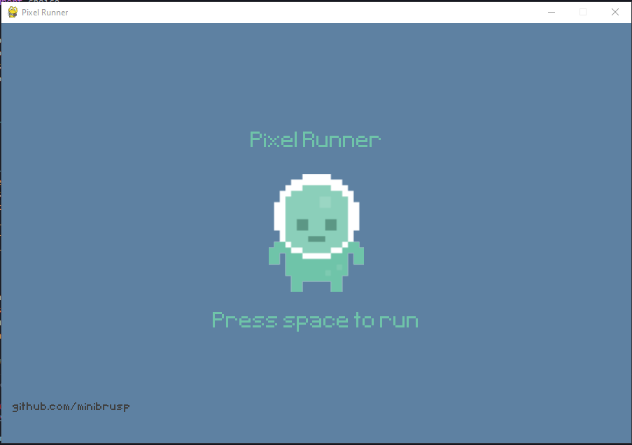
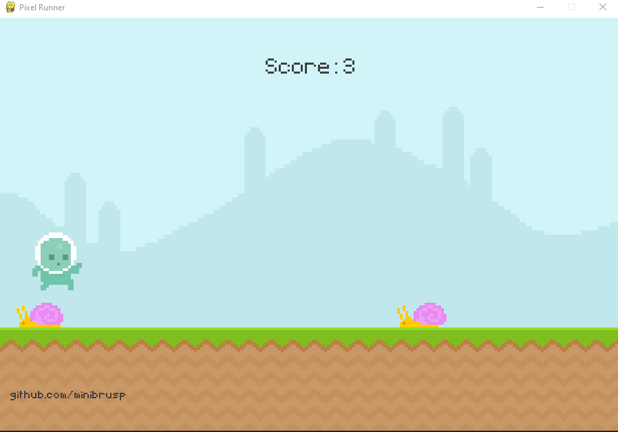

# PIXEL RUNNER

- Pixel Runner made with pygame 2.5.2
- after watching a tutorial decided to re build this on my own.
- Thanks to Kenny with the image assets(https://opengameart.org/content/platformer-art-pixel-edition)
- And also Thanks to SubspaceAudio for the BGMs (https://opengameart.org/content/5-chiptunes-action)

| menu / intro                       | in game                               |
| ---------------------------------- | ------------------------------------- |
|  |  |

### clone repo

```
git clone https://github.com/minibrusp/pygame-pixel-runner.git
```

### navigate to project folder

```
cd pygame-pixel-runner
```

### create a virtual env

```
python -m venv .venv
```

### create a virtual env

```
python -m venv .venv
```

### activate virtual env

#### macos

```
 source .venv/bin/activate
```

#### windows

```
 source .venv/Scripts/activate
```

### install dependencies

```
pip install -r requirements.txt
```

### run project

```
python main.py
```
